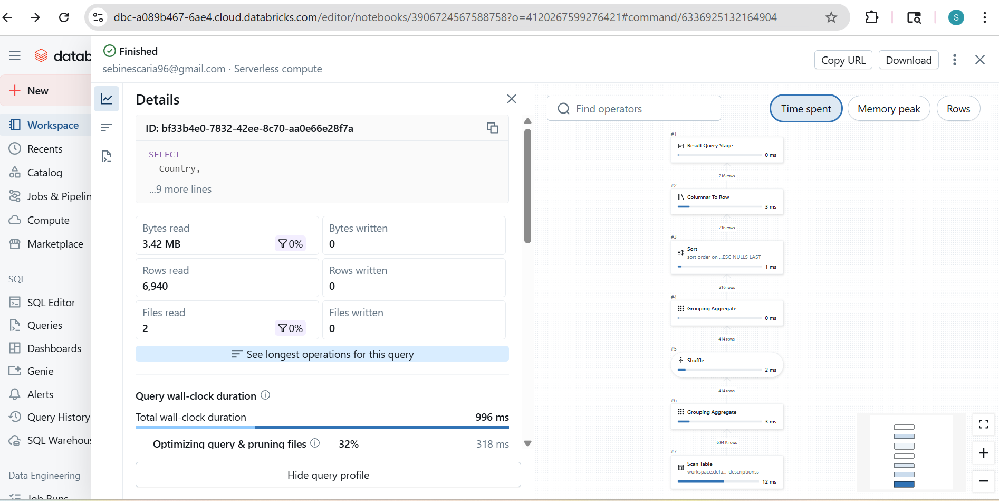
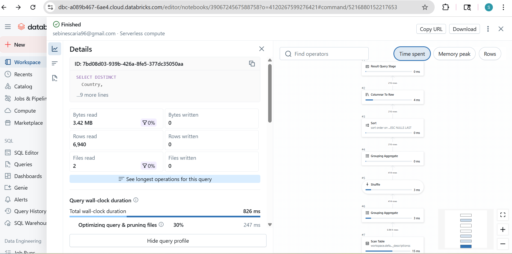

### Data-Processing-using-PySpark
Analyzing Job Description Data using PySpark

## About the Dataset
The dataset is called 'Job Descriptions' which I got from Kaggle and it talks about the types of jobs looking for specific qualifications being offered around the world.

## Using .explain() to show the physical execution plan
I ran the explain method on the df dataframe.
```
df.explain()
```

This is the result that I got:

``` == Physical Plan ==
*(1) ColumnarToRow
+- PhotonResultStage
   +- PhotonProject [Job Id#18142L, Experience#18143, Qualifications#18144, Salary Range#18145, location#18146, Country#18147, latitude#18148, longitude#18149, Work Type#18150, Company Size#18151L, Job Posting Date#18152, Preference#18153, Contact Person#18154, Contact#18155, Job Title#18156, Role#18157, Job Portal#18158, Job Description#18159, Benefits#18160, skills#18161, Responsibilities#18162, Company#18163, Company Profile#18164, min_salary#18167, max_salary#18169, ... 4 more fields]
      +- PhotonProject [Job Id#18142L, Experience#18143, Qualifications#18144, Salary Range#18145, location#18146, Country#18147, latitude#18148, longitude#18149, Work Type#18150, Company Size#18151L, Job Posting Date#18152, Preference#18153, Contact Person#18154, Contact#18155, Job Title#18156, Role#18157, Job Portal#18158, Job Description#18159, Benefits#18160, skills#18161, Responsibilities#18162, Company#18163, Company Profile#18164, min_salary#18167, max_salary#18169, ... 3 more fields]
         +- PhotonProject [Job Id#18142L, Experience#18143, Qualifications#18144, Salary Range#18145, location#18146, Country#18147, latitude#18148, longitude#18149, Work Type#18150, Company Size#18151L, Job Posting Date#18152, Preference#18153, Contact Person#18154, Contact#18155, Job Title#18156, Role#18157, Job Portal#18158, Job Description#18159, Benefits#18160, skills#18161, Responsibilities#18162, Company#18163, Company Profile#18164, cast(regexp_replace(trim(split(Salary Range#18145, -, 2)[0], None), [^0-9], , 1) as int) AS min_salary#18167, cast(regexp_replace(trim(split(Salary Range#18145, -, 3)[1], None), [^0-9], , 1) as int) AS max_salary#18169]
            +- PhotonScan parquet workspace.default.job_descriptionss[Job Id#18142L,Experience#18143,Qualifications#18144,Salary Range#18145,location#18146,Country#18147,latitude#18148,longitude#18149,Work Type#18150,Company Size#18151L,Job Posting Date#18152,Preference#18153,Contact Person#18154,Contact#18155,Job Title#18156,Role#18157,Job Portal#18158,Job Description#18159,Benefits#18160,skills#18161,Responsibilities#18162,Company#18163,Company Profile#18164] DataFilters: [], DictionaryFilters: [], Format: parquet, Location: PreparedDeltaFileIndex(1 paths)[s3://dbstorage-prod-9tfcv/uc/a8b373c4-2e45-46f6-9b72-4c4052bfedd8..., OptionalDataFilters: [], PartitionFilters: [], ReadSchema: struct<Job Id:bigint,Experience:string,Qualifications:string,Salary Range:string,location:string,..., RequiredDataFilters: []


== Photon Explanation ==
The query is fully supported by Photon.
== Optimizer Statistics (table names per statistics state) ==
  missing = 
  partial = 
  full    = job_descriptionss
```
Here's what is going on:
PhotonScan parquet -> Reads the Parquet files from the job_descriptionss table. Since DataFilters and PartitionFilters are empty, it’s doing a full table scan.

PhotonProject -> Applies column selections and transformations, such as splitting the Salary Range column and creating min_salary and max_salary.

PhotonResultStage / ColumnarToRow -> Converts columnar data back into row format for display in the notebook or driver.

“The query is fully supported by Photon” -> Everything runs using Databricks’ optimized Photon engine, which is fast and efficient.

Optimizer statistics: full -> The table has complete stats, so the optimizer can plan efficiently.

## Optimizing my Query by PySpark
I was working on a SQL query where I had to query for countries where they offer 'Data Scientist' roles. 

The Query looked like this
```
SELECT
  Country,
  COUNT(*) AS num_data_scientist_jobs
FROM
  job_descriptionss
WHERE
  `Job Title` = 'Data Scientist'
GROUP BY
  Country
ORDER BY
  num_data_scientist_jobs DESC 
```

When I ran it to see it's performance this was what I saw:


This made me realise to use a better version of the query for faster execution and I came up with this code:
```
SELECT
  DISTINCT Country,
  COUNT(*) AS num_data_scientist_jobs
FROM
  job_descriptionss
WHERE
  `Job Title` = 'Data Scientist'
GROUP BY
  Country
ORDER BY
  num_data_scientist_jobs DESC 
```

When I ran it to see it's performance this was what I saw:


When you compare these two pictures, you can see that for the same results, the first query took more time (996ms) to execute than the second query (826 ms), which shows that the second query is better optimized than the first one. 

I applied filters strategically early in the pipeline, immediately after reading the Parquet source data. By filtering on selective conditions like experience levels, location, and job categories before performing joins and aggregations, I reduced the dataset size at the earliest possible stage. This filter-first approach allowed Spark to push predicates down to the file scan level, minimizing disk I/O and the amount of data loaded into memory for downstream transformations.
I used explicit select() statements throughout the pipeline to retain only the columns required for each subsequent operation. Rather than carrying all 24 columns through every transformation, I projected only necessary fields after each stage. For example, after creating derived columns with withColumn(), I immediately selected relevant columns and dropped intermediate fields. This column pruning reduced memory consumption and improved performance by minimizing the data shuffled during joins and aggregations. 

## Difference between Lazy transformation and Action
In this code:

```
filtered_df2 = df.filter(
    (col("avg_salary") > 65) &
    (col("avg_experience") > 7)
)
filtered_df2.show()
``` 


